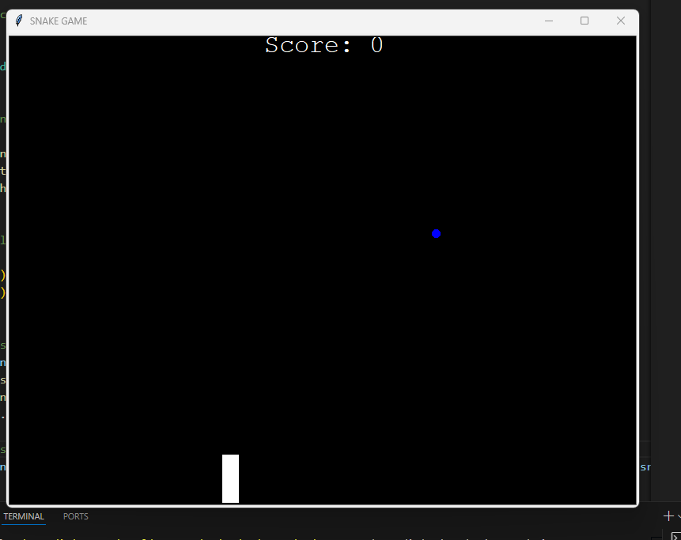

# Snake Game

This project is a **classic Snake Game** implemented in Python using the `turtle` module. It is designed not only to provide a fun and interactive gaming experience but also to serve as an educational resource for beginners who want to learn more about **object-oriented programming (OOP)**, **classes**, and **modules** in Python.

---

## 🌟 Motivation

The primary motivation behind creating this project is to help **beginners** understand the practical use of **classes** and **modules** in Python. By breaking the game into smaller, reusable components, this project demonstrates how to:

- **Organize code** into separate files (modules) for better readability and maintainability.
- **Use classes** to encapsulate functionality and create reusable objects.
- **Apply OOP principles** like encapsulation, inheritance, and modular design.

This project is a great exercise for anyone looking to strengthen their Python programming skills while building something fun and interactive!

---

## 🎮 Features

- **Snake Movement**: Use arrow keys to control the snake's direction.
- **Food**: The snake grows longer each time it eats food.
- **Scoreboard**: Displays the current score and a "Game Over" message when the game ends.
- **Start Screen**: The game starts when the user presses the "Enter" key.

---

## 🛠️ How to Play

1. Run the `main.py` file.
2. Use the arrow keys (`Up`, `Down`, `Left`, `Right`) to control the snake.
3. Avoid colliding with the walls or the snake's own body.
4. Try to eat as much food as possible to increase your score.

---

## 📂 File Structure

- **`main.py`**: The main game logic and entry point.
- **`snake.py`**: Contains the `Snake` class, which handles the snake's behavior (movement, growth, and direction changes).
- **`foods.py`**: Contains the `Food` class, which manages the food's appearance and random positioning.
- **`scoreboard.py`**: Contains the `Scoreboard` class, which displays the score and game-over message.

---

## 🧑‍💻 Learning Objectives

By exploring this project, you will learn:

1. **How to use classes** to create objects with specific behaviors and attributes.
2. **How to organize code** into modules for better structure and reusability.
3. **How to use the `turtle` module** to create graphical applications in Python.
4. **How to implement a game loop** and handle user input in real-time.

---

## 💻 Requirements

- Python 3.x

---

## 🚀 How to Run

1. Clone or download this repository.
2. Navigate to the project folder.
3. Run the following command:
   ```bash
   python main.py